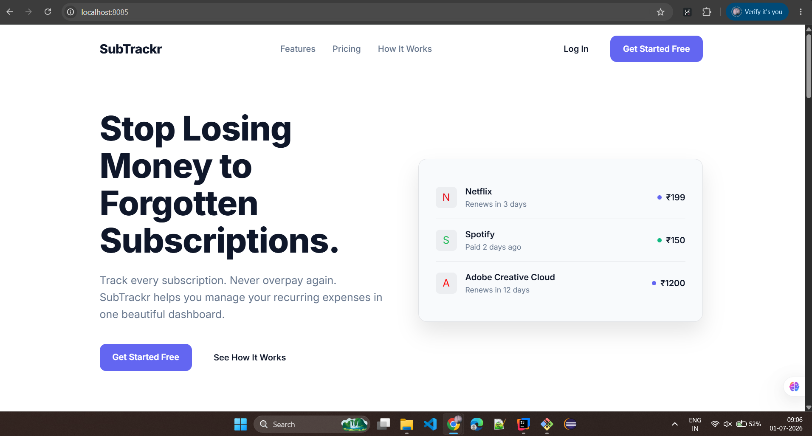
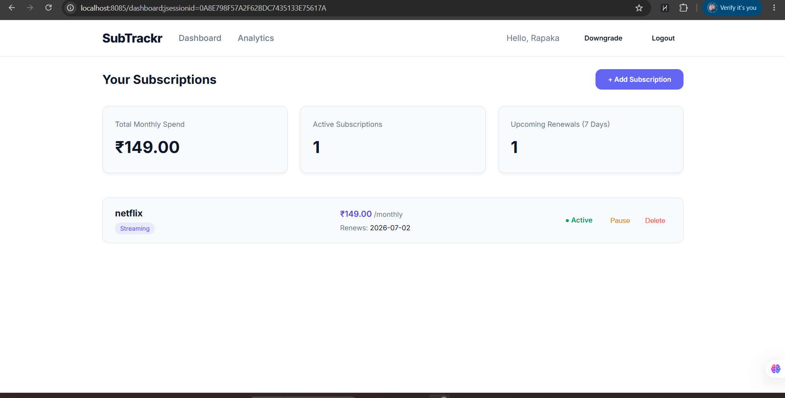
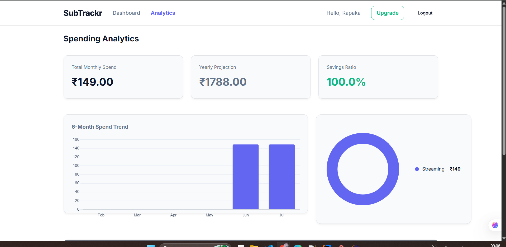

# Subscription Management System (SMS)

A full-stack web application developed using **Spring Boot** that helps users efficiently manage their subscriptions in one place. The application allows users to track active subscriptions, monitor renewal dates, receive email reminders before expiry, and manage their subscription details securely.

---

## Features

- User Registration & Login
- Secure Authentication
- Dashboard to View Active Subscriptions
- Add New Subscription
- Update Subscription Details
- Delete Subscription
- Search and Filter Subscriptions
- Track Renewal Dates
- Automatic Email Reminder Notifications Before Subscription Expiry
- Responsive and User-Friendly Interface

---

## Tech Stack

### Backend
- Java 21
- Spring Boot
- Spring MVC
- Spring Data JPA
- Hibernate
- Maven

### Frontend
- HTML
- CSS
- JavaScript
- Thymeleaf

### Database
- MySQL

### Tools
- IntelliJ IDEA
- Git & GitHub
- Postman

---

## Project Structure

```
Subscription-Management-System/
│── src/
│── pom.xml
│── schema.sql
│── README.md
│── .gitignore
└── screenshots/
```

---

## Modules

### User Module
- Register
- Login
- Profile Management

### Subscription Module
- Add Subscription
- Update Subscription
- Delete Subscription
- View All Subscriptions
- Search Subscriptions

### Reminder Module
- Automatic Email Notifications
- Renewal Date Tracking
- Reminder Scheduling

---

## Email Reminder Feature

The application automatically sends email reminders before a subscription renewal date to help users avoid missing payments.

### Workflow

1. User adds a subscription.
2. User selects the renewal date.
3. System stores the subscription details.
4. A scheduled task checks upcoming renewals.
5. Reminder emails are sent before the renewal date.

---

## Database Setup

1. Install MySQL.
2. Create a database.
3. Run the `schema.sql` script.
4. Configure the database credentials in:

```
src/main/resources/application.properties
```

Example:

```properties
spring.datasource.url=jdbc:mysql://localhost:3306/subscription_db
spring.datasource.username=root
spring.datasource.password=your_password
```

---

## Installation

Clone the repository

```bash
git clone https://github.com/your-username/subscription-management-system.git
```

Move into the project folder

```bash
cd subscription-management-system
```

Run the application

```bash
mvn spring-boot:run
```

The application will be available at

```
http://localhost:8080
```

---

## 📸 Screenshots

### Home Page


### Login Page


### Dashboard


### Analytics


### Premium Analytics


### Payment Gateway


### Payment Success


### Email Reminder


## Future Enhancements

- SMS Notifications
- Payment Gateway Integration
- Monthly Expense Analytics
- Subscription Categories
- Admin Dashboard
- JWT Authentication
- Cloud Deployment
- Mobile Application

---

## Author

**Thanmai Rapaka**

GitHub: https://github.com/thanmairapaka08

LinkedIn: https://linkedin.com/in/thanmai rapaka

---

## License

This project is developed for learning, academic, and placement purposes.
